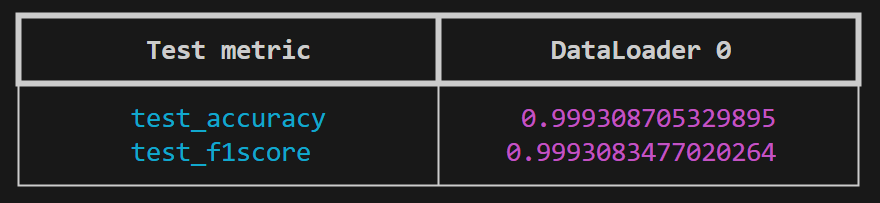
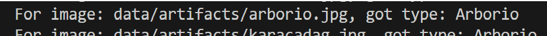

# RiceTypeImageDetection

**Жарова Татьяна**

> Мне не удалось создать хранилища на Google Drive и Amazon (для S3), поэтому
> используетсся локальное хранилище. К сожалению, из-за этого недоступны версии
> модели с примерами. Однако все команды можно запустить, если обучить модель.

## Постановка задачи

Задача – на основе изображение предсказывать тип риса. Рассматриваю этот проект
как учебный, чтобы больше поработать с моделями, работающими с изображениями. За
основу взят ноутбук с
[kaggle](https://www.kaggle.com/code/dima806/rice-type-image-detection-vit).

### Формат входных и выходных данных

На вход подаётся изображение (в форматах jpeg, png), выход – название типа риса
в текстовом виде.

### Метрики

Метрики стандартные: Accuracy и F1-score (ожидаемые значения не менее 0.75 для
обоих для хорошего предсказания)

### Валидация

Для валидации набор данных буду делить в соотношении 80/20, для
воспроизводимости зафиксирую конкретный seed 83.

### Данные

Датасет - данные взяла из
[kaggle](https://www.kaggle.com/datasets/muratkokludataset/rice-image-dataset):
Rice. Всего там 5 сортов риса: Арборио, Басмати, Ипсала, Жасмин и Каракадаг. Для
тренировки (+ валидации) и тестирования данные делятся в соотношении 80/20,
далее данные для тренировки + валидации бьются в соотношении 80/20 для этапов
тренировки и валидации.

## Моделирование

### Бейзлайн

В качестве простого бейзлайн-решения используется логистическая регрессия,
обученная на эмбеддингах изображений, извлечённых с помощью предобученной
сверточной нейросети (feature extractor). Нейросеть используется в режиме
inference, без дообучения, и служит для преобразования изображения в вектор
фиксированной размерности.

### Основная модель

Модель основана на архитектуре Vision Transformer, привожу ссылку из
[ноутбука на huggingface](https://huggingface.co/google/vit-base-patch16-224-in21k).
Всего 86.4 M параметров, и общий размер равен 346 Мегабайт. Это будет обучение
на приведённом ранее наборе данных.

### Внедрение

Интересно попробовать использовать модель как сервис, который будет запущен
рядом с основным кодом какого-либо приложения.

## Setup

Разработка проводилась на сервере с операционной системой Linux, GPU RTX 4090.
Для установки зависимостей использовался poetry, достаточная версия Python -
3.10. Для настройки и возможности повторить действия необходимо следующее:

- `git pull https://github.com/TaniaZharova2205/RiceTypeImageDetection.git`
- `sudo apt-get update`
- `sudo apt-get install nvidia-cuda-toolkit libboost-all-dev python3-dev build-essential`
- `poetry install --no-root`
- `eval $(poetry env activate)`

## Train

Чтобы запустить тренировку, достаточно из корня репозитория выполнить команду

- `python3 rice_type_image_detection/command.py train`

Запущенный процесс скачает данные, если не сможет их получить из локального
хранилища dvc, натренирует модель и сохранит полученную модель в директорию
`models`. На данный момент там лежит \*.dvc файл с примером модели. В процессе
обучения будут предобработаны скачанные данные, и в файлы
data/labels_metainfo/id2labels_metainfo.json и
data/labels_metainfo/labels2id_metainfo.json запишется информация о классах и их
идентификаторах (это тип риса). Эта информация понадобится позже при
тестировании и поставляется в dvc-формате.

При этом предполагается, что mlflow server уже поднят. При обучении параметры
логгируются в директорию mlflowruns, генерируемые графики сохраняются в
директорию mlflowruns/plots.

Для тестирования из корня репозитория нужно выполнить команду

- `python3 rice_type_image_detection/command.py test --test_dir=<директория с моделями> --checkpoint_name=<имя файла чекпоинта в указанной ранее директории>`

Ниже привожу пример команды для примеров, прелставленных в репозитории:
`python3 rice_type_image_detection/command.py test --test_dir=./models --checkpoint_name='model_val_loss=1.12.ckpt'`



dvc файлы при этом распакуются автоматически, в случае если Вы владеете
локальным хранилищем либо обучение завершилось успешно.

## Production preparation

Представлено три способа инференса модели: из чекпоинта, из \*.onnx формата и из
\*.trt.

- onnx: модель переводится в \*.onnx сразу после окончания тренировки. Имя
  итоговой модели подтягивается из конфигурационного файла. Для удобства в
  директории models представлена модель `model.onnx.dvc` в dvc.

- перевод из формата onnx в trt производится при помощи скрипта (запустите
  команду
  `./scripts/convert2tensorrt.sh <путь до onnx модели от корня репозитория> <директория, в которую нужно поместить итоговую модель> <имя желаемой модели без расширения>`).
  Для удобства в директории models представлена модель `model.fp32.trt.dvc` в
  dvc. При этом необходимо учитывать, что пакет tensorrt на устройстве должен
  поддерживать версию 10.11.0.33 для успешного перевода. Чтобы можно было
  запускать скрипт с переводом в TensorRT, может быть полезно установить пакеты
  из начала документа.

- triton:

  - Чтобы локально развернуть сервер c моделью, выберите имя сети
    докер-контейнеру и запишите его в `.env` файл в переменную `NETWORK_NAME`.

    Пример:

    ```
    NETWORK_NAME=rice_type_image_detection_triton
    ```

  - Из корня репозитория запустите команду

    `dotenv -e <путь до Вашего .env файла> ./scripts/setup_triton_before_launch.sh <путь до модели в формате onnx> <версия модели> <путь до данных>`

    Тестовый пример на предоставленных данных:

    `dotenv -e .env ./scripts/setup_triton_before_launch.sh models/model.onnx 1 data/artifacts`

    Все данные из dvc распакуются сами.

    Здесь используется путь до onnx модели, так как на сервере, где проводилась
    разработка генерируется \*.trt модель другой версии сериализации. В Triton
    Server'е она понижена до 8.6.3.

  - Чтобы опустить локальный Triton сервер, из корня репозитория запустите
    команду

    `dotenv -e <путь до Вашего .env файла> ./scripts/shut_down_triton.sh`

## Infer

1. **Входные данные.**

На вход принимается директория с изображениями (форматы \*.jpg, \*.png), в
качестве примера можно использовать data/artifacts (содержатся в репозитории в
формате dvc, перед запуском примеров с data/artifacts.dvc ничего не нужно
делать). В случае, если скрипты не находят директорию, они попытаются её достать
из dvc. Так как используется локальное хранилице dvc, для получения арефактов из
открытых источников, а не \*.dvc файла, запустите следующие команды:

- `cd scripts`
- `sudo chmod a+x download_artifacts.sh`
- `./download_artifacts.sh`

Тогда из открытых источников скачается картинка риса в директорию
data/artifacts, после чего её можно передавать в скрипты инференса на вход
моделям.

2. **Запуск.**

   - Запуск инференса из чекпоинта:

     `python3 rice_type_image_detection/command.py infer from_checkpoint --models_dir=models --checkpoint_name='model_val_loss=1.12.ckpt' --images_to_analyze='data/artifacts'`

   - Запуск инференса для модели в формате onnx:

     `python3 rice_type_image_detection/command.py infer onnx --model_path=models/model.onnx --images_to_analyze='data/artifacts'`

   - Запуск инференса для модели в формате TensorRT:

     `python3 rice_type_image_detection/command.py infer onnx --model_path=models/model.fp32.trt --images_to_analyze='data/artifacts'`

   - Запуск для Triton Server:

     `python3 rice_type_image_detection/command.py infer triton --url=<url triton сервера> --images_to_analyze=triton/images`

3. **Примеры.** Пример выхода для каждого из файлов в директории:



# Ссылки

- Оригинальный ноутбук:

  - https://www.kaggle.com/code/dima806/rice-type-image-detection-vit

- Данные:

  - https://www.kaggle.com/datasets/muratkokludataset/rice-image-dataset

- Обучаемая модель:
  - https://huggingface.co/google/vit-base-patch16-224-in21k
